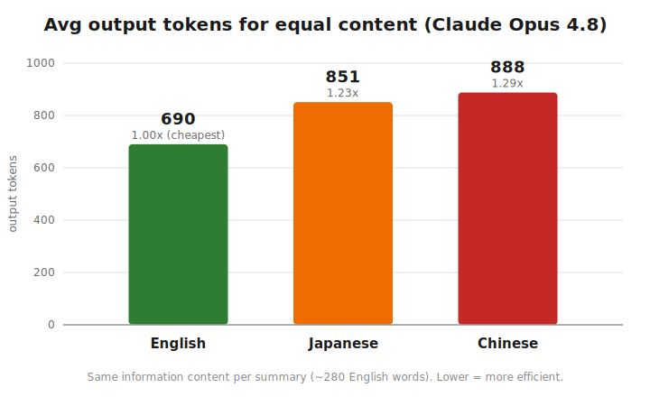

# Claude Opus 4.8 の言語別トークン効率の検証

[English](README.md) | **日本語**

「AIは英語で訓練されているから、英語で出力させればトークンを節約できる」——本当でしょうか？ このリポジトリは、Claude Opus 4.8 が **同じ情報量の要約** を英語・日本語・中国語で生成するときに、**出力トークンを何個使うか** を計測したものです。生データ・スクリプト・入力原本をすべて公開しているので、誰でも再現できます。

**結論を先に言うと:** 同じ情報量なら、**英語がいちばんトークン効率が良い** です。同じ内容を表すのに、日本語は英語の約 1.23 倍、中国語は約 1.29 倍の出力トークンを使いました。

> ⚠️ **正直な注記:** この検証の最初のバージョンでは、**真逆の結果**(「中国語は約3倍高い」)が出ていました。これは計測ミスです。言語をまたいで **文字数をそろえる** のは不公平で、中国語の 280 文字は英語の 280 文字の約5倍の情報量を含むためです。**情報量** をそろえるように直したところ、結論が逆転しました。このバグと修正の経緯も以下に記録しています——それがこの検証の半分の目的です。

## 結果

各 **出力言語** ごとの平均出力トークン数です(すべての要約が、英語で約 280 語ぶんの同じ情報量を持つように調整)。

| 出力する言語 | 平均 出力トークン | 英語比 | 実際の中身 |
|---|---|---|---|
| 🇺🇸 英語  | **690** | **1.00倍(最安)** | 272〜277 語 |
| 🇯🇵 日本語 | 851 | 1.23倍 | 約 890〜955 文字 |
| 🇨🇳 中国語 | 888 | 1.29倍 | 約 865〜936 文字 |



コストを決めるのは **「読む言語(入力)」ではなく「書く言語(出力)」** でした。何語を読ませても、英語で答えさせればいちばん安く収まります。

9パターンぶんの生データは [`results.csv`](results.csv) にあります。

## 検証方法と、そこにあった落とし穴

この検証は 3×3 のマトリクスです:{英語, 中国語, 日本語} の原本を読み、{英語, 中国語, 日本語} で要約させる = 9 パターン。

**落とし穴:** 最初のバージョンは全言語に「280〜300文字で要約して」と指示しました。しかし——
- 英語の 280 文字 ≒ **約 50 語**(2〜3 文の短いメモ)
- 中国語・日本語の 280 文字 ≒ **250 語以上の情報**(段落まるごと。漢字1文字が単語1個ぶんの意味を持つため)

つまり「英語の短いメモ」と「中国語のしっかりした段落」を比べて「中国語のほうがトークンが多い」と結論していたわけです。トークナイザではなく、情報量の差を測っていただけでした。

**修正:** 各言語が同じ **情報量**(英語で約 280 語)になるように指定を変えました。
- 英語: 260〜300 **語**
- 中国語: 750〜850 **文字**
- 日本語: 850〜950 **文字**

中身をそろえてはじめて、本当の結果が見えてきます——同じ意味を、英語がいちばん少ないトークンで表せる、ということです。

## このリポジトリの中身

| ファイル | 説明 |
|------|-------------|
| [`opus48_runner.sh`](opus48_runner.sh) | 検証スクリプト本体(zsh + `curl` + `jq`)。9 パターンをループし、Anthropic API を叩き、トークン数とコストを CSV に記録します。 |
| [`results.csv`](results.csv) | 生データ。1 行 = 1 パターン: 入力/出力トークン、思考文字数、応答の文字数・コードポイント数・語数、実行時間、応答本文。 |
| `source_en.txt` / `source_ja.txt` / `source_zh.txt` | 入力原本。同じ内容(AWS「Amazon Bedrock 上の Claude」紹介ページ)を3言語で用意し、3言語に共通するセクションだけに揃えたもの。 |
| `make_chart.py` | 結果のグラフ(`output_tokens_by_language.svg`)をデータから再生成する、依存ライブラリ不要のスクリプト。 |

## 再現方法

必要なもの: `zsh`, `curl`, `jq`, `python3`, そして Anthropic API キー。

```sh
# 1. jq が無ければインストール
brew install jq

# 2. API キーを環境変数にセット(スクリプトは環境変数から読みます。コードに直書きしないこと)
export ANTHROPIC_API_KEY=sk-ant-...

# 3. 実行
./opus48_runner.sh
```

結果は `results.csv` に書き出され、実行中はパターンごとのトークン数と累計コストがターミナルに表示されます。`effort=medium` で 9 パターン全体のコストは約 $0.25 です。

## 検証の限界

- **各パターン 1 回ずつ(n=1)** の計測です。英語が最安という結果は3つの入力言語すべてで一貫していた(690 ± 30 トークン)ものの、試行回数は少ないです。
- **「情報量をそろえた」のは概算** です。「中国語 750〜850 文字 ≒ 英語 280 語」はキャリブレーションによる見積もりで、厳密に同じ情報量だとは証明できません。ただし 2〜3 割の差は多少のズレでは消えません。
- **文章は1種類** だけ(AWS の製品紹介ページ)。コードや技術文書では傾向が変わるかもしれません。
- **`effort=medium`、Opus 4.8 のみ** で、思考オフ / Sonnet / Haiku との比較基準はありません。
- **CSV カラムの注意:** `response_runes` が真の文字数で、`response_chars` はバイト長(CJK は1文字あたり約3バイトなので大きく見えます)。`response_words` は英語でのみ意味があります(CJK は単語間に空白が無いため)。

## ライセンス

[MIT](LICENSE) — データもスクリプトも自由にお使いください。
